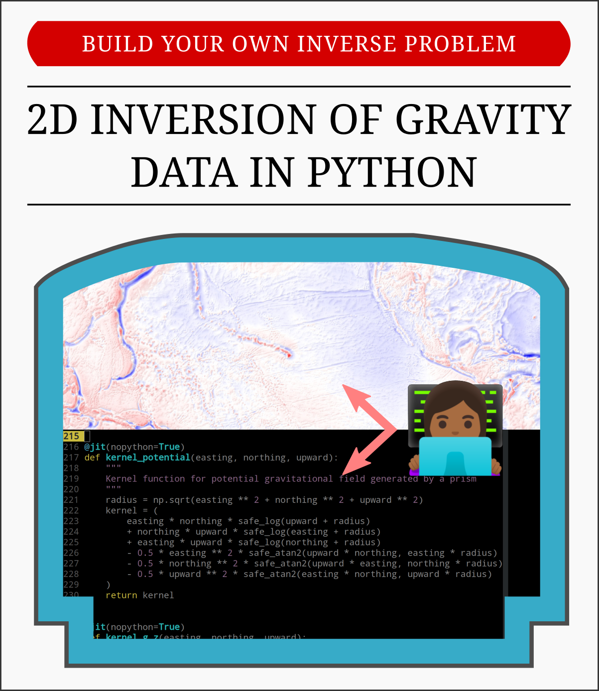

# Let's build a geophysical inversion with Python

**Instructor:** [Leonardo Uieda](https://www.leouieda.com/)1

> 1 Department of Earth, Ocean and Ecological Sciences,
> School of Environmental Sciences, University of Liverpool, UK

Short course on geophysical inversion at RWTH Aachen University
graduate school [IRTG-2379 Modern Inverse Problems](
https://blog.rwth-aachen.de/irtg-mip/about-irtg-2379/).

|        | Info |
|-------:|:-----|
|When    | 15 December / 13:00 - 16:30 CEST (UTC+2) |
|Where   | Online via Zoom |
|YouTube | TBD |

## Abstract

Inverse problems abound in geophysics.
It is the primary way in which we investigate the subsurface of the Earth,
which is largely inaccessible to us beyond the first dozen or so kilometers.
From measurements acquired on land, sea, air, and from space, geophysicists
tease out the inner structure of the Earth - from a few meters to thousands of
kilometers deep in the inner core.
Observations of disturbances in the Earth's gravity field are one of the key
elements used by geophysicists to investigate the crust-mantle interface, the
large-scale structure of sedimentary basins (which are reservoirs for water and
hydrocarbons), and even the mass balance of the world's ice sheets.
However, the gravity inverse problem is particularly challenging due to the
physics of potential fields.
Unique solutions are difficult to come by and only exist under strict
assumptions, which often don't hold for real world scenarios.
For these problems, regularization plays a critical role and has been the focus
of much research in the past 20 years.

In this tutorial, we will work together to solve a 2D gravity inverse problem
in Python.
Our code will estimate the shape of a sedimentary basin from gravity
observations.
This non-linear inverse problem will allow us to visually explore the effects
of different types of regularization from a geometric perspective (smoothness,
equality constraints, and more).
We will discuss the challenges involved in real world applications and the
difficulties of quantifying the uncertainty in the solutions.
The main goal of this tutorial is to impart theoretical and practical
skills that can be easily transfered to other domains.

## Format and schedule

The course will be a mix of short presentations mixed with live coding
(I will lead and learners will follow on their own computers). Participants 
will also be assigned some short challenges to complete.

The following is a tentative schedule:

| Session 1 | 13:00 - 14:30 |
|:----------|:--------------|
| Introductions | 10 min |
| ... | 10 min |

**Break:** 30 minutes

| Session 2 | 15:00 - 16:30 |
|:----------|:--------------|
| ... | 10 min |
| ... | 10 min |
| Wrap up | 10 min |

## Setup (BEFORE THE WORKSHOP)

Since there is large component of live coding, participants will
have to set up their computers **before the workshop**. It's 
extremely important that everyone has a working Python environment
ahead of time as there will not be enough time to sort out 
individual problems during the workshop.

Introductions coming soon...

## License

All code and text in this repository is free software:
you can redistribute it and/or modify it under the terms of the
MIT License. A copy of this license is provided in
[LICENSE.txt](https://github.com/compgeolab/2020-aachen-inverse-problems/blob/main/LICENSE.txt)).
